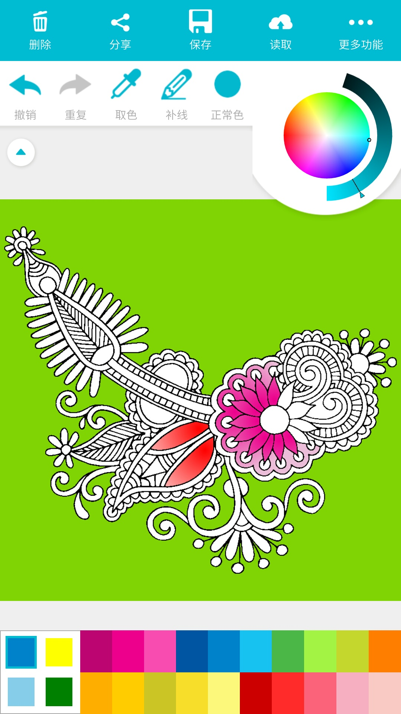
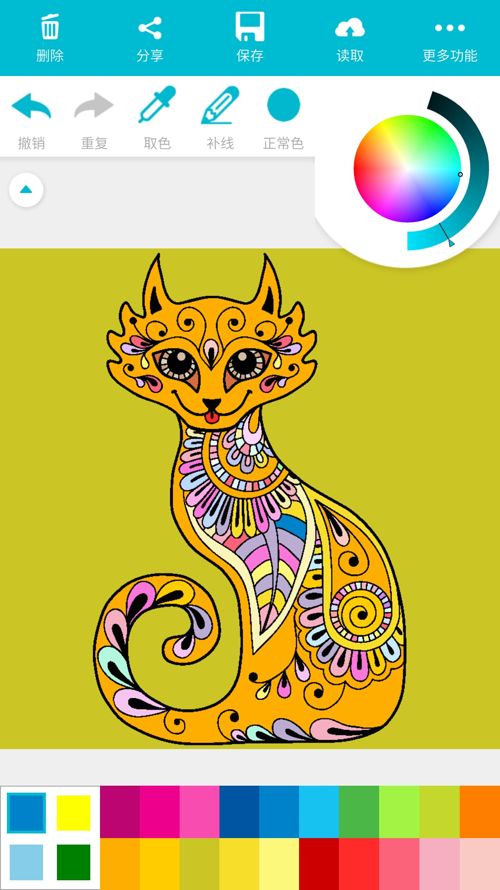
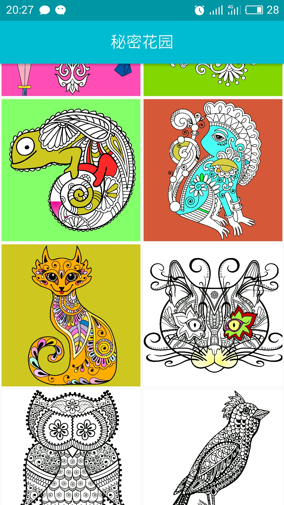

<h3>It is a hobby project made by me, the main function is let users to fill the image and paint a beautiful image！</h3>

<h2>Update at 18 Nov 2016:</h2>
Open source this application now! Current version is 1.2.0 
There are nearly 100K users downloaded this app from application markets, here are some screenshot of the app: 

 
there are 2 more repostories also open source: 
[Java Backend](https://github.com/SwiftyWang/FingerColoring-Backend-Java-) load image data from server 
[Image Process](https://github.com/SwiftyWang/FingerColoring-ImageProcess) to process the image from the webside. 

But sadly currrent backend is in AWS but only the one year free server and also the server currently has some problem. 

<h2>Update at 11 Aug 2015:</h2>
and image resources in this website: http://www.coloring-book.info 
and some libraries in github. 

welcome to star&fork it! Welcome to build it together! HAVE FUN!!! 
 
now has completed: 
1.three hardcode paint-themes     
2.grab thumb image danymic from internet 
3.show paint image, and use ColourImageView to fill the color. 
 
It is very interesting!!! 
 
to do list: 
（√）1. danymic to load theme list(IF can translate to Chinese is better). 
（√）2. improve paint page. add new INTERESTING functions!! 
（√）3. store all data into local DB(now use Jsoup to parse it is not very good). 
 
